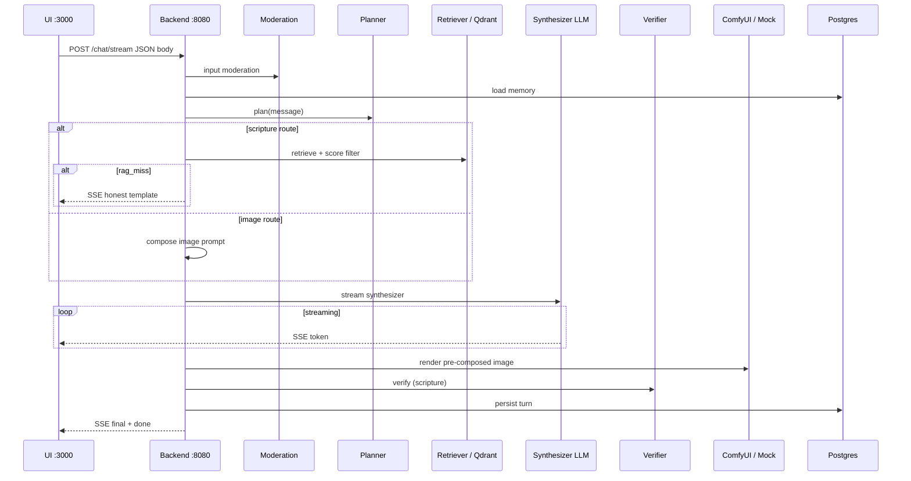

# System architecture overview

## High-level diagram

```
                         ┌──────────────────────────────────┐
                         │         User / Agent             │
                         └──────────┬──────────────┬────────┘
                                    │              │
                              HTTP  │              │ MCP (streamable-http)
                                    ▼              ▼
                         ┌──────────────┐  ┌──────────────┐
                         │  Next.js UI  │  │  FastMCP     │
                         │  :3000       │  │  :8001       │
                         └──────┬───────┘  └──────┬───────┘
                                │                 │
                                └────────┬────────┘
                                         │ REST / SSE
                                         ▼
                         ┌───────────────────────────────────┐
                         │       FastAPI Gateway :8080       │
                         │                                   │
                         │  Routers                          │
                         │   chat · search · verify · image  │
                         │   compose · moderate · session    │
                         │                                   │
                         │  Services                         │
                         │   planner · moderation            │
                         │   retriever · verifier            │
                         │   prompt_builder · image_prompt   │
                         │   memory · chat_store             │
                         │                                   │
                         │  Clients                          │
                         │   llm · embeddings · qdrant       │
                         │   comfy                           │
                         └─────┬──────┬──────┬──────┬───────┘
                               │      │      │      │
              ┌────────────────┘      │      │      └────────────────┐
              ▼                       ▼      ▼                       ▼
       ┌────────────┐          ┌──────────┐ ┌──────────┐       ┌────────────┐
       │ vLLM       │          │ ComfyUI  │ │ Qdrant   │       │ Postgres   │
       │ :8000      │          │ :8188    │ │ :6333    │       │ :5432      │
       │ Qwen2.5-VL │          │ Juggernaut│ │ vectors  │       │ sessions   │
       └────────────┘          └──────────┘ └──────────┘       └────────────┘
                                                                    │
                                                              media volume
                                                              /data/media
```

## Design principles

1. **Single gateway** — The UI and MCP server never call GPU services directly. All
   logic (moderation, RAG, verification, memory) lives in the FastAPI backend so
   behaviour is consistent regardless of client.

2. **Dev/prod parity** — The same code path runs in dev (mock LLM/image) and prod
   (real models). Mocks are swappable via `LLM_BACKEND` and `IMAGE_BACKEND` env vars.

3. **Planner-gated work** — The planner classifies each message (normal / scripture /
   image) so RAG, verification, and image generation only run when needed. RAG miss
   short-circuits with an honest template (no hallucination).

4. **Layered safety** — Rule-based moderation is always on; an optional LLM judge
   adds a second opinion in prod. Image prompts go through the same safety patterns.

5. **Durable by default** — Postgres stores full conversation history and image
   metadata; files live on a named Docker volume served at `/media`.

## Chat request flow



## Data stores

| Store | Technology | What it holds | Used by |
| ----- | ---------- | ------------- | ------- |
| Vector DB | Qdrant (`bible_verses`) | Embedded Bible verses (7 translations) | Retriever, Verifier |
| Relational DB | Postgres | Sessions, turns, image metadata | Chat store, UI sidebar |
| File volume | Docker `media_data` | Rendered PNG images | Backend static route `/media` |
| HF cache | Docker `hf_cache` | Qwen model weights | vLLM |
| Kaggle cache | Docker `kagglehub_cache` | Downloaded Bible dataset | Ingest job |
| Host `models/` | Bind mount | Juggernaut SDXL checkpoint | ComfyUI |

## Phase map

| Phase | Feature | Key files |
| ----- | ------- | --------- |
| 1 | Foundation, Docker Compose, mocks | `docker-compose*.yml`, clients |
| 2 | Orchestrator script, RAG grounding | `infrastructure/`, `retriever.py` |
| 3 | Kaggle Bible dataset, verse verification | `ingest/`, `verifier.py` |
| 4 | ComfyUI + Juggernaut image generation | `comfy_client.py`, `image_prompt.py` |
| 5 | Conversation memory, denomination framing | `memory.py`, `prompt_builder.py` |
| 6 | Safety & moderation layer | `moderation.py` |
| 7 | Intent orchestrator + prompt composer | `orchestrator.py`, `compose.py` |
| 11 | Planner + Synthesizer brain | `planner.py`, RAG miss, `startup.sh` |
| 8 | SSE streaming + last-3-turns window | `chat.py` (stream), `context_recent_turns` |
| 9 | Postgres chat store + image persistence | `chat_store.py`, `db/models.py` |
| 10 | UI history sidebar + multi-session | `ui/app/page.tsx`, `ui/lib/api.ts` |

## Network topology (Docker)

All services share the `appnet` bridge network. Internal DNS names match service
names (`backend`, `qdrant`, `postgres`, `vllm`, `comfyui`, `mcp-server`). Only
selected ports are published to the host.

The `gpu` Compose profile gates `vllm` and `comfyui`. The `ingest` profile gates
the one-shot ingestion container.

## Why this architecture

- **FastAPI as gateway** — You already know FastAPI; it gives typed schemas, async
  I/O, OpenAPI docs, and static file serving for images in one process.
- **vLLM for inference** — OpenAI-compatible API, efficient GPU serving, supports
  Qwen2.5-VL for both chat and optional vision/moderation tasks.
- **Qdrant for RAG** — Lightweight, Docker-native vector DB with filtering (used for
  denomination canon tags on verse payloads).
- **FastMCP for agents** — Exposes the same backend capabilities to LangChain/ReAct
  agents without duplicating business logic.
- **Postgres for durability** — Relational model fits sessions/turns/images; async
  SQLAlchemy keeps the gateway non-blocking.
- **ComfyUI for images** — Workflow-based SDXL rendering with Juggernaut; env-driven
  parameters avoid hardcoded prompts.

## Further reading

- [Backend service](../services/backend.md)
- [UI service](../services/ui.md)
- [Infrastructure](../infrastructure.md)
