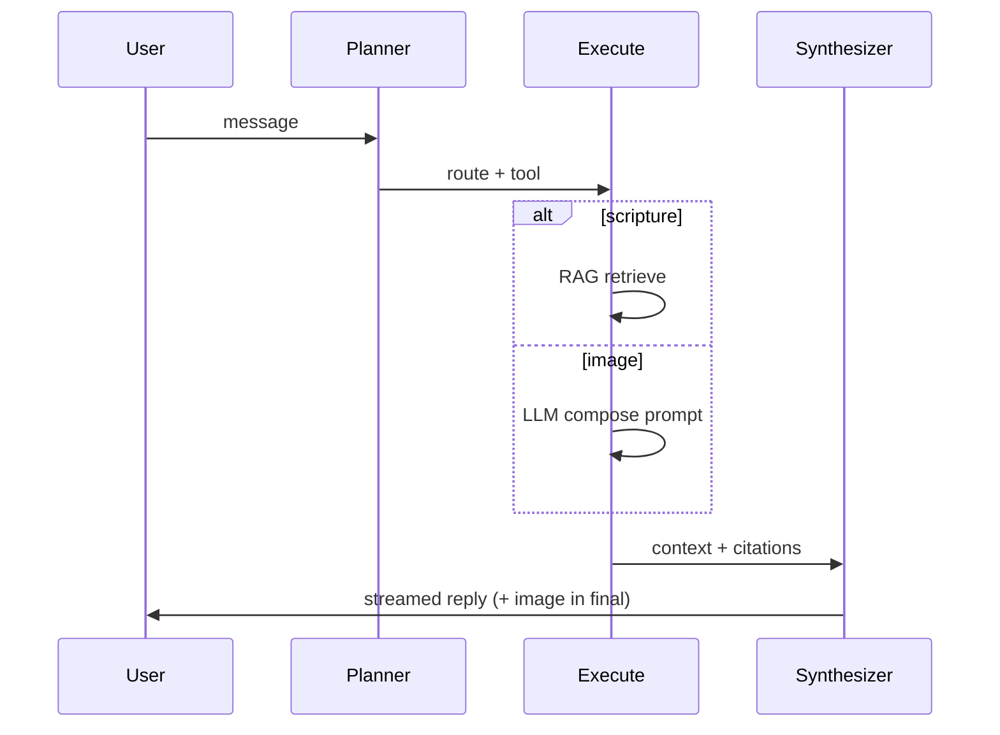

# Planner (chat brain)

**Path:** `services/backend/app/services/planner.py`  
**Role:** First phase of every chat turn — decides route and tool before execution.

## Why it exists

The assistant must not run RAG, image generation, or heavy LLM work on every message.
The planner is the **brain** that classifies each user message into one of three routes
so downstream steps only run when needed.

## Planner → Execute → Synthesizer



| Phase | What runs | LLM call? |
| ----- | --------- | --------- |
| **Planner** | Classify route: normal / scripture / image | Yes when `LLM_BACKEND=vllm`; rules when mock |
| **Execute** | RAG search or image prompt compose | Image compose only (execution LLM) |
| **Synthesizer** | Generate the chat reply | Yes (streamed to UI) |

## Routes

| Route | When | Tool | RAG? |
| ----- | ---- | ---- | ---- |
| `normal` | Off-topic, greetings, non-faith questions | — | No |
| `scripture` | Bible, Jesus, faith, prayer, church | `scripture_search` | Yes |
| `image` | User wants a picture/photo/drawing | `generate_image` | No |

Image route wins when both image and scripture cues appear (e.g. "draw Jesus on the cross").

## Dev vs prod (one project, two modes)

Same planner code runs in both deploy modes:

| Mode | `LLM_BACKEND` | Planner behaviour |
| ---- | ------------- | ----------------- |
| dev | `mock` | Deterministic regex rules (`classify_rules`) |
| prod | `vllm` | Qwen2.5-VL returns JSON `{route, reason}` |

Parse failure in prod falls back to rules automatically.

## RAG miss (no hallucination)

When route is `scripture` but retrieval returns no verses above `RAG_MIN_SCORE`:

1. Backend sets `rag_miss=true` on the intent in the response.
2. Returns `RAG_MISS_REPLY` template **without** calling the synthesizer.
3. Prevents the model from inventing scripture.

## Configuration

| Variable | Default | Purpose |
| -------- | ------- | ------- |
| `ORCHESTRATOR_ENABLED` | `true` | Master switch (legacy name) |
| `PLANNER_INSTRUCTION` | (see `.env.example`) | vLLM planner system prompt |
| `RAG_MIN_SCORE` | `0.35` | Minimum Qdrant similarity |
| `RAG_MISS_REPLY` | (honest template) | Short-circuit reply |

`ORCHESTRATOR_LLM_INTENT` is deprecated; vLLM planner is automatic when `LLM_BACKEND=vllm`.

## API exposure

The planner result is returned as `intent` on chat responses and in the SSE `meta` event:

```json
{
  "kind": "scripture",
  "needs_rag": true,
  "tool": "scripture_search",
  "source": "rules",
  "reason": "Message mentions Christianity...",
  "rag_miss": null
}
```

## Related docs

- [Backend](backend.md) — full chat pipeline
- [vLLM](vllm.md) — planner, synthesizer, and composer LLM calls
- [Qdrant](qdrant.md) — RAG retrieval in execution phase
